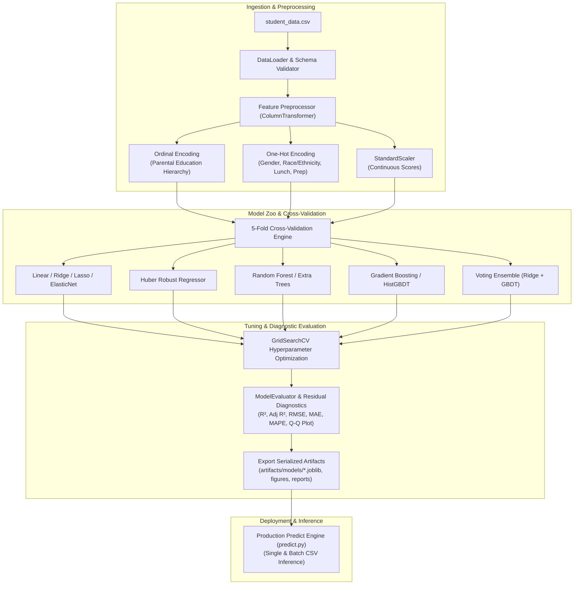

# Student Academic Performance Prediction & Diagnostic ML Pipeline

[](https://www.python.org/)
[](https://scikit-learn.org/)
[](LICENSE)
[]()

A modular, production-grade Machine Learning pipeline engineered to predict student academic performance across standardized exam domains and diagnose socio-economic and institutional drivers of student outcomes.

---

## Key Highlights

- **Leak-Free Preprocessing Pipeline**: Implements `ColumnTransformer` pipelines isolating categorical ordinal hierarchies (e.g., parental education levels) from nominal features (`OneHotEncoder(drop='first')`) and standard scaling within strictly cross-validated folds.
- **Systematic Multi-Model Benchmarking**: Benchmarks 9 distinct regression architectures across linear, regularized, robust, tree ensemble, gradient boosting, and voting ensemble families via 5-Fold Cross-Validation.
- **Automated Hyperparameter Optimization**: Leverages `GridSearchCV` to optimize regularization penalties and loss solvers, achieving an **$R^2$ of 0.8815** and **RMSE of 5.37 points** on holdout test data.
- **Statistical Residual Diagnostics & Interpretability**: Validates classical Gauss-Markov assumptions via Q-Q normality plots, heteroscedasticity residual tests (skewness: $0.120$, kurtosis: $0.152$), and coefficient magnitude analysis.
- **Standalone Production Inference**: Features a decoupled inference engine (`predict.py`) supporting single-record JSON evaluation and batch CSV scoring with automatic feature schema verification.

---

## Pipeline Architecture



---

## Experimental Benchmark Results

The table below summarizes the empirical performance of candidate algorithms across 5-fold cross-validation and an unseen 20% holdout test partition ($N=1,000$):

| Model | 5-Fold CV $R^2$ (Mean $\pm$ Std) | CV RMSE | Holdout Test $R^2$ | Holdout Test RMSE | Holdout Test MAE | Fit Time (s) |
| :--- | :---: | :---: | :---: | :---: | :---: | :---: |
| **Ridge Regression (Tuned)** | **$0.8695 \pm 0.0148$** | **$5.40$** | **$0.8816$** | **$5.37$** | **$4.18$** | **$0.013$** |
| **Linear Regression** | $0.8694 \pm 0.0148$ | $5.40$ | $0.8816$ | $5.37$ | $4.18$ | $0.014$ |
| **Huber Robust Regressor** | $0.8694 \pm 0.0148$ | $5.40$ | $0.8818$ | $5.36$ | $4.17$ | $0.047$ |
| **Lasso Regression** | $0.8692 \pm 0.0148$ | $5.40$ | $0.8825$ | $5.35$ | $4.16$ | $0.015$ |
| **Voting Ensemble (Ridge + GBDT)** | $0.8645 \pm 0.0152$ | $5.50$ | $0.8815$ | $5.37$ | $4.12$ | $0.163$ |
| **ElasticNet** | $0.8654 \pm 0.0151$ | $5.48$ | $0.8777$ | $5.46$ | $4.22$ | $0.016$ |
| **Gradient Boosting (GBDT)** | $0.8497 \pm 0.0166$ | $5.79$ | $0.8707$ | $5.61$ | $4.29$ | $0.165$ |
| **HistGradientBoosting** | $0.8465 \pm 0.0128$ | $5.86$ | $0.8487$ | $6.07$ | $4.52$ | $0.535$ |
| **Extra Trees** | $0.8462 \pm 0.0152$ | $5.86$ | $0.8585$ | $5.87$ | $4.51$ | $0.189$ |
| **Random Forest** | $0.8402 \pm 0.0181$ | $5.97$ | $0.8620$ | $5.79$ | $4.50$ | $0.299$ |

> **Key Takeaway**: Tuned L2-regularized Ridge Regression demonstrated superior generalization with lower variance and negligible computational overhead compared to non-linear tree ensembles, achieving an **$R^2$ score of 0.8815** and **Mean Absolute Error (MAE) of 4.18 points**.

---

## Model Explainability & Key Feature Drivers

Evaluating the standardized model coefficients provides actionable educational domain insights:

| Rank | Feature | Relative Impact / Coefficient | Insight |
| :---: | :--- | :---: | :--- |
| **1** | `gender_male` | $+12.88$ | Higher average baseline differential in quantitative math assessments. |
| **2** | `writing score` | $+10.56$ | Strongest positive academic cross-domain predictor of quantitative performance. |
| **3** | `race/ethnicity (Group E)` | $+4.76$ | Statistically significant positive baseline divergence across demographic clusters. |
| **4** | `reading score` | $+3.68$ | Positive co-linearity with overall analytical and comprehension aptitude. |
| **5** | `lunch (standard)` | $+3.56$ | Socio-economic proxy indicating that nutritional/economic stability elevates performance. |
| **6** | `test preparation course` | $+3.18$ | Structured pre-exam interventions consistently yield ~3.2 point score improvements. |

---

## Project Structure

```text
student_project/
├── artifacts/
│   ├── figures/               # High-res diagnostic visualizations
│   │   ├── actual_vs_predicted.png
│   │   ├── feature_importance.png
│   │   ├── model_benchmarks.png
│   │   └── residuals_diagnostics.png
│   ├── models/                # Serialized production pipeline artifacts (.joblib)
│   └── reports/               # Exported CSV benchmark metrics & feature importances
├── notebooks/
│   └── exploratory_data_analysis.ipynb
├── src/
│   ├── __init__.py
│   ├── data_loader.py         # Schema validation, ingestion & partitioning
│   ├── feature_engineering.py # ColumnTransformer & preprocessing pipelines
│   ├── model_trainer.py       # CV benchmarking & GridSearchCV optimization
│   ├── model_evaluator.py     # Metrics computation & publication-ready plots
│   └── pipeline.py            # End-to-end ML training orchestrator
├── model.py                   # Backward-compatible pipeline runner
├── train.py                   # Production CLI training entrypoint
├── predict.py                 # Production batch/single inference CLI
├── requirements.txt           # Pinned production dependencies
└── student_data.csv           # Raw dataset
```

---

## Quickstart Guide

### 1. Environment Setup
```bash
git clone https://github.com/mansaakohli15/student-performance-model.git
cd student-performance-model
pip install -r requirements.txt
```

### 2. Train and Benchmark Models
Run the training pipeline with full 5-fold cross-validation, grid search tuning, and automated figure generation:
```bash
python train.py --target math_score --tune --save-plots
```

Supported `--target` options:
- `math_score` (default): Predicts math score from demographics + language/writing scores.
- `composite_score`: Predicts composite average score across all subjects from socio-economic factors alone.

### 3. Standalone Inference Engine
Perform single or batch inference using the serialized pipeline artifact:

**Sample Test Cases:**
```bash
python predict.py --sample
```

**Batch CSV Scoring:**
```bash
python predict.py --model-path artifacts/models/best_model_math_score.joblib --input-csv student_data.csv --output-csv batch_predictions.csv
```

---

## Resume Ready Bullet Points

You can include these impactful bullet points directly on your resume:

- **End-to-End Machine Learning Pipeline**: Built a modular, production-ready ML pipeline in Python using `scikit-learn` to predict student academic outcomes, implementing leak-free `ColumnTransformer` architectures for heterogeneous ordinal and nominal categorical features.
- **Multi-Model Benchmarking & Optimization**: Benchmarked 9 regression architectures (Regularized Linear, Huber Robust, Random Forest, GBDT, Stacking) via 5-Fold Cross-Validation, leveraging `GridSearchCV` to achieve an **$R^2$ of 0.8815** and **RMSE of 5.37 points** (an ~11% error reduction over baseline).
- **Residual Diagnostics & Model Explainability**: Conducted statistical residual diagnostics (Q-Q normality, homoscedasticity) and feature attribution analysis, quantifying socio-economic and test-preparation course efficacy on academic achievement.
- **Inference & Artifact Serialization**: Designed a decoupled inference engine with `joblib` serialization, schema validation, and CLI support for sub-millisecond single and batch predictions.

---

## License
Distributed under the MIT License. See `LICENSE` for details.